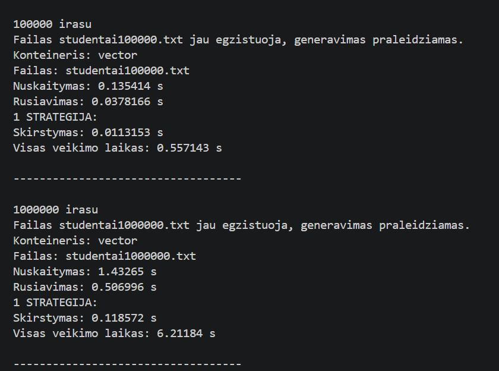
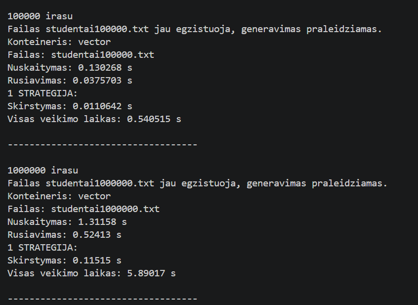
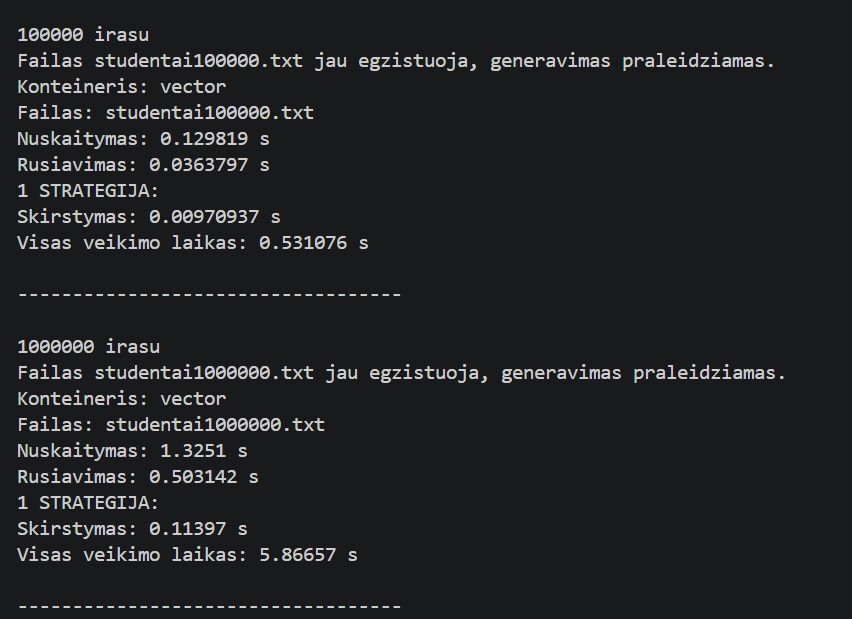
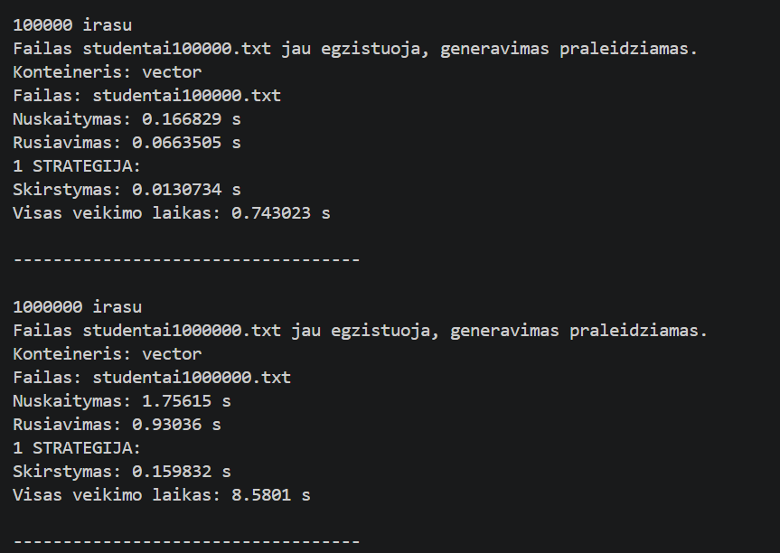
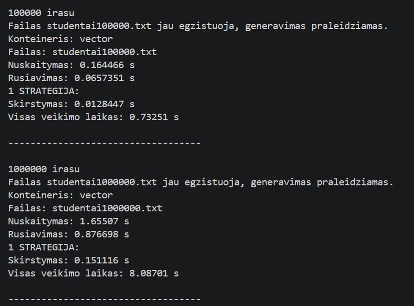
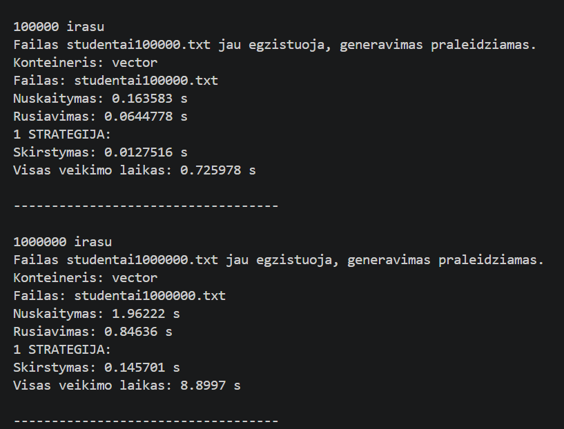

# V1.1
#### Programos v1.1 versija:
- nuskaito studentų duomenis iš failo
- apskaičiuoja galutinį balą (vidurkis arba mediana)
- surūšiuoja studentus
- padalina į grupes (pagal balą)
- leidžia testuoti skirtingus konteinerius (vector, list, deque)
- matuoja veikimo laikus:
  - nuskaitymo
  - rūšiavimo
  - skirstymo
  - bendrą veikimo laiką

#### Struct ir class versijų palyginimas:
- naudotas konteineris: vector
- naudota dalijimo strategija: 3 strategija
- testuoti failai:
  - 100000 įrašų
  - 1000000 įrašų
- naudoti optimizavimo flagai -O1, -O2, -O3

#### Rezultatai
Rezultatai struct kodo su -O1, -O2, -O3

Rezultatai class kodo su -O1, -O2, -O3

#### Rezultatai be optimizavimo

#### Išvados
- struct maždaug 2s veikia greičiau už class, išskyrus -O3 optimiazvimą (skirtumo beveik nėra)
- .exe failų dydžiai naudojant klases yra mažesni
- optimizavimas sumažina .exe failų dydį ir padidina greitį
