# Programa analizuojanti studentų duomenis

## Naudojimosi instrukcija
x

## Ankstesni release: 
### v0.1
* Sukurta pradinė programos versija
* Įgyvendintas studentų duomenų įvedimas ranka ir generavimas atsitiktinai
* Apskaičiuojamas galutinis balas (vidurkis ir mediana)
* Realizuotas bazinis meniu pasirinkimams
* Naudota dinaminė atmintis (C masyvai) ir std::vector konteineris
### v0.2
* Patobulinta ankstesnė versija
* Pridėtas duomenų nuskaitymas iš failų (skirtingo dydžio testiniai failai)
* Galimybė pasirinkti galutinio balo skaičiavimo būdą (vidurkis arba mediana)
* Rezultatų išvedimas į ekraną arba failą
* Programa veikia cikliškai pagal vartotojo pasirinkimus
### v0.3
* Pagerinta programos struktūra
* Kodas išskaidytas į kelis .cpp ir .h failus
* Pridėtas exception handling (klaidų valdymas)
* Pagerintas programos aiškumas
### v0.4
* Pridėtas failų generavimas testavimui
* Įgyvendintas studentų rūšiavimas pagal reikalavimus
Studentai skirstomi į dvi grupes:
  * „kietiakai“
  * „vargšiukai“
* Sukuriami atskiri failai kiekvienai studentų grupei
* Atlikti pirminiai programos veikimo spartos testai

## v1.0 - studentų rūšiavimo ir failų generavimo programa

### Aprašymas:
Ši programos versija v1.0 sukurta v0.4 pagrindu.
Programoje realizuotas studentų failų generatorius, studentų duomenų nuskaitymas, galutinio balo skaičiavimas, studentų optimizuotas skirstymas į dvi kategorijas ir rezultatų išvedimas į atskirus failus. Papildomai atliktas skirtingų konteinerių veikimo spartos tyrimas.

#### Studentai skirstomi į dvi grupes:
- vargšiukai – kai galutinis balas < 5.0
- kietiakai – kai galutinis balas >= 5.0

#### v1.0 versijoje atlikti koregavimai:
- Sukurta nauja šaka v1.0 pagal v0.4
- Išlaikytas failų generatorius ir testavimo failai
- Įgyvendintas konteinerių veikimo spartos tyrimas naudojant:
  - std::vector
  - std::list
  - std::deque
- Programoje pritaikyta galimybė testuoti skirtingus konteinerius
- Atlikta spartos analizė su skirtingais konteineriais
- Bandytos 3 strategijos geriausiai spartai rasti

### Tyrimai:

Kompiuterio parametrai:

### Tyrimas pagal 1 strategiją:
Buvo matuojama:
- duomenų nuskaitymas iš failo į atitinkamą konteinerį
- rūšiavimas didėjančia tvarka konteineryje
- studentų skirstymas į dvi grupes

#### Testavimo rezultatai:

#### RAM kaita prieš programos paleidimą ir jos veikimo metu:
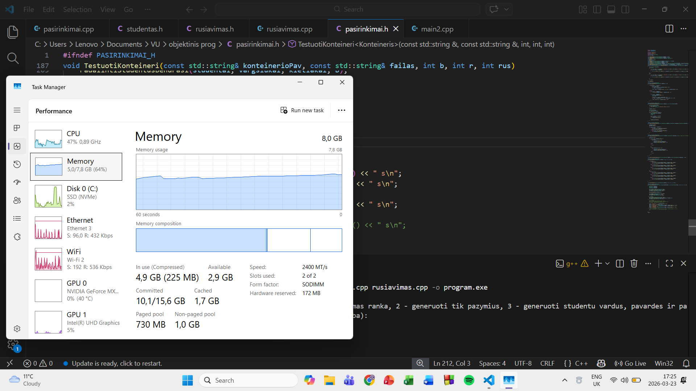
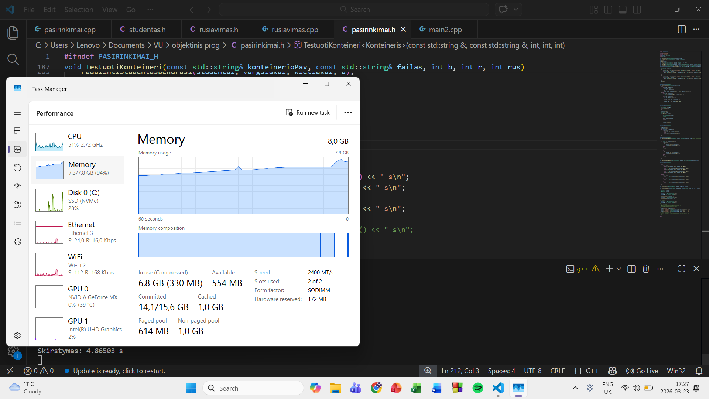 

### Tyrimas paga 2 strategiją:
Buvo matuojama:
- duomenų nuskaitymas iš failo į atitinkamą konteinerį
- rūšiavimas didėjančia tvarka konteineryje
- studentų skirstymas į vargšiukų grupę, jei atitinka reikalavimus ir naikinimas iš bendro studentų sąrašo taip jame paliekant tik kietiakus

#### Testavimo rezultatai:

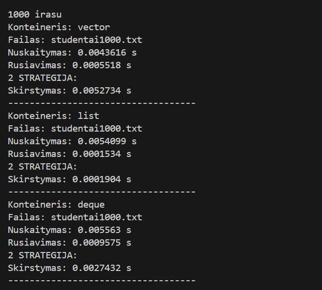
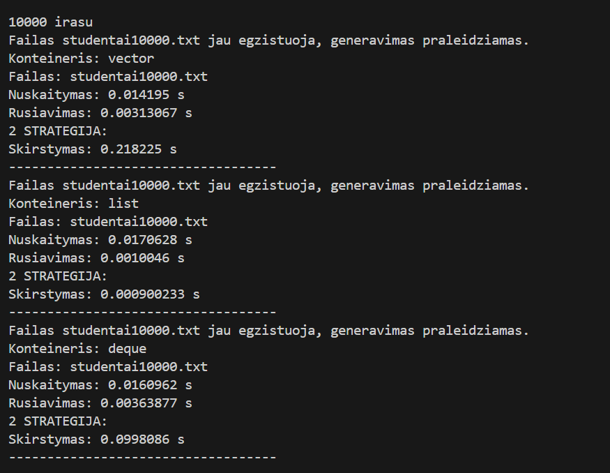
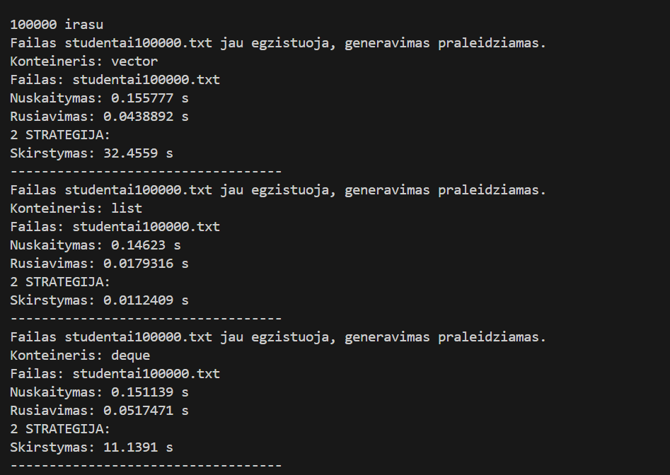

#### RAM kaita prieš programos paleidimą ir jos veikimo metu:
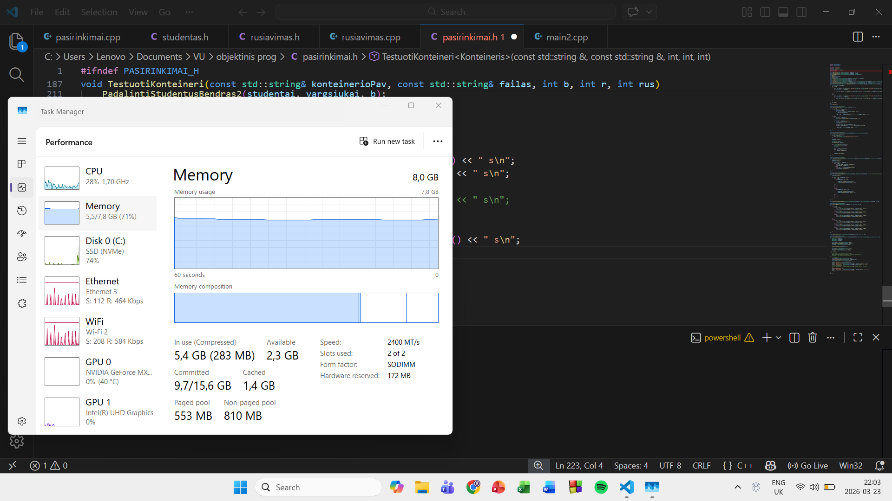
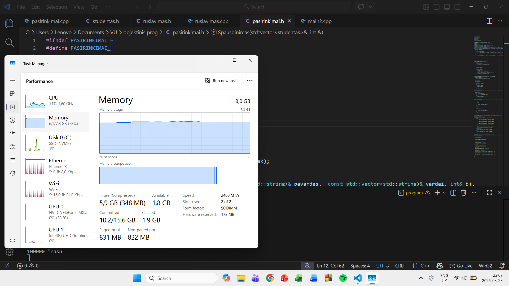

#### Pastebime, kad RAM mažiau apkrautas 2 strategijos veikimo metu, tačiau ties 1000000 įrašų failu rezultatų nebesulaukiame. List naudojant šią strategiją veikia itin sparčiai. Vector ir deque reikalingas spartinimas. Tam naudosime std::stable_partition.

### Tyrimas paga 3 strategiją:
Buvo matuojama:
- duomenų nuskaitymas iš failo į atitinkamą konteinerį
- rūšiavimas didėjančia tvarka konteineryje
- studentų skirstymas į vargšiukų grupę, jei atitinka reikalavimus ir naikinimas iš bendro studentų sąrašo taip jame paliekant tik kietiakus (skirtingai list nuo deque ir vector, kad visi veiktų sparčiai)

#### Testavimo rezultatai:

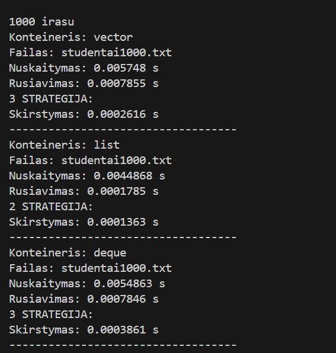
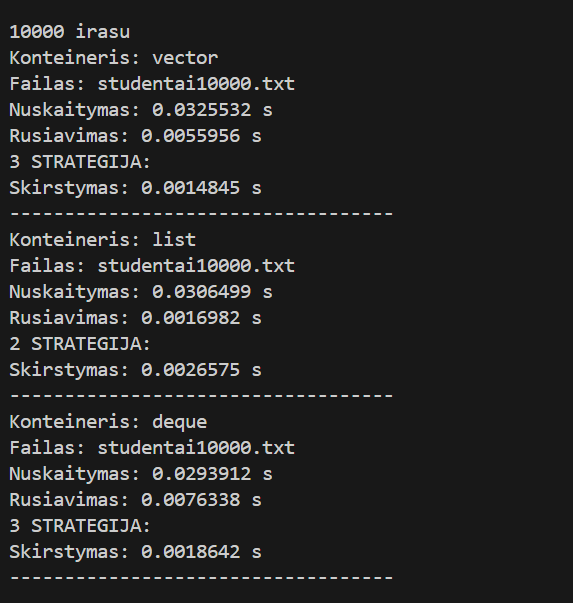
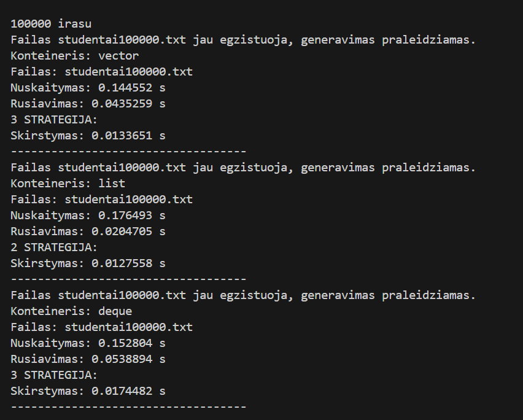
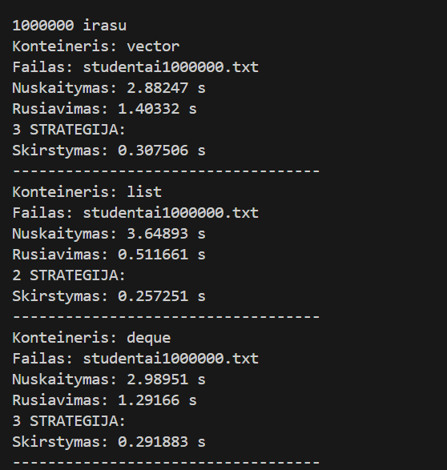
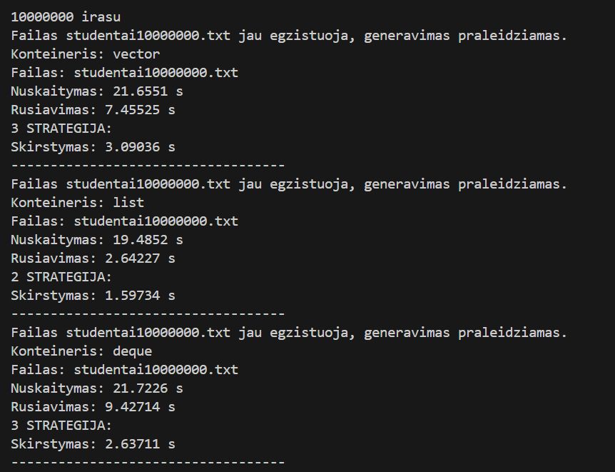

#### RAM kaita prieš programos paleidimą ir jos veikimo metu:
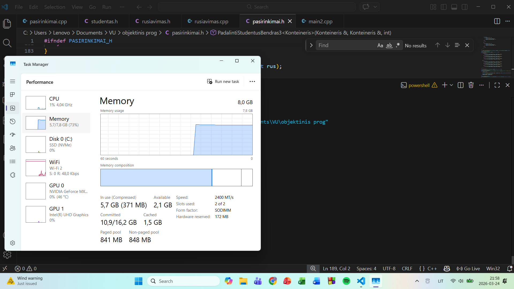
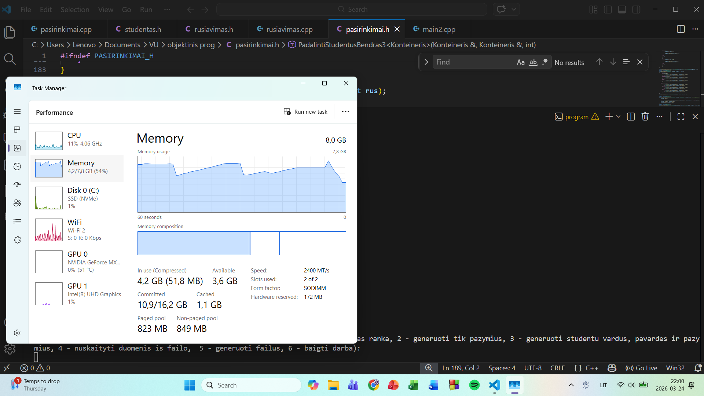
