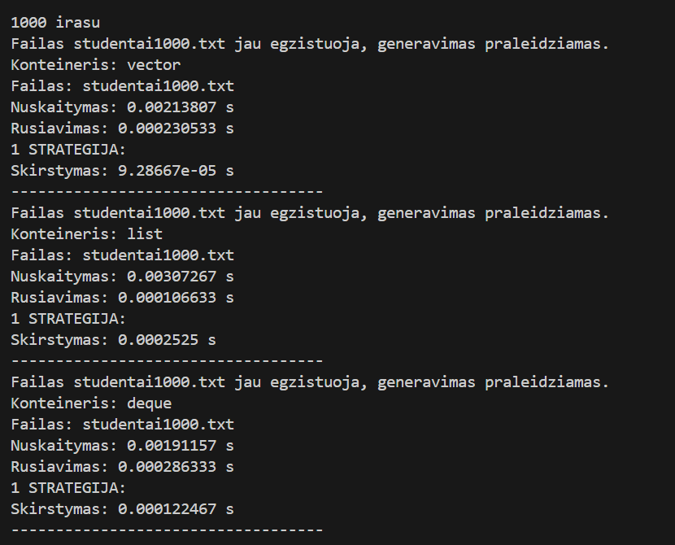
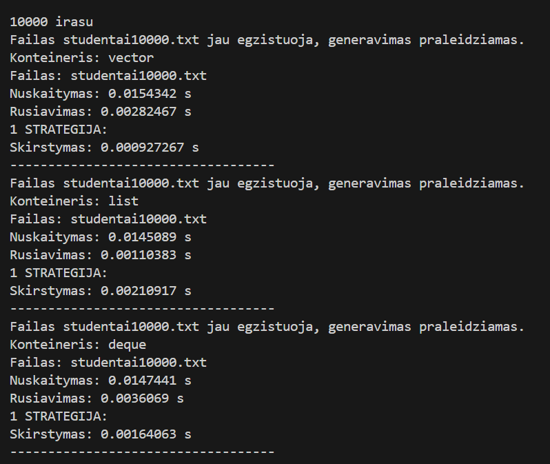
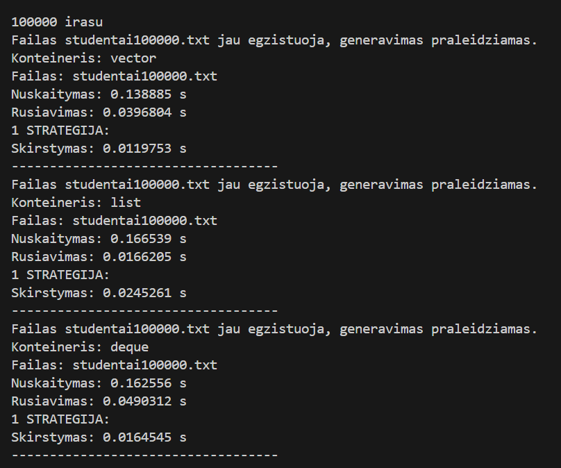
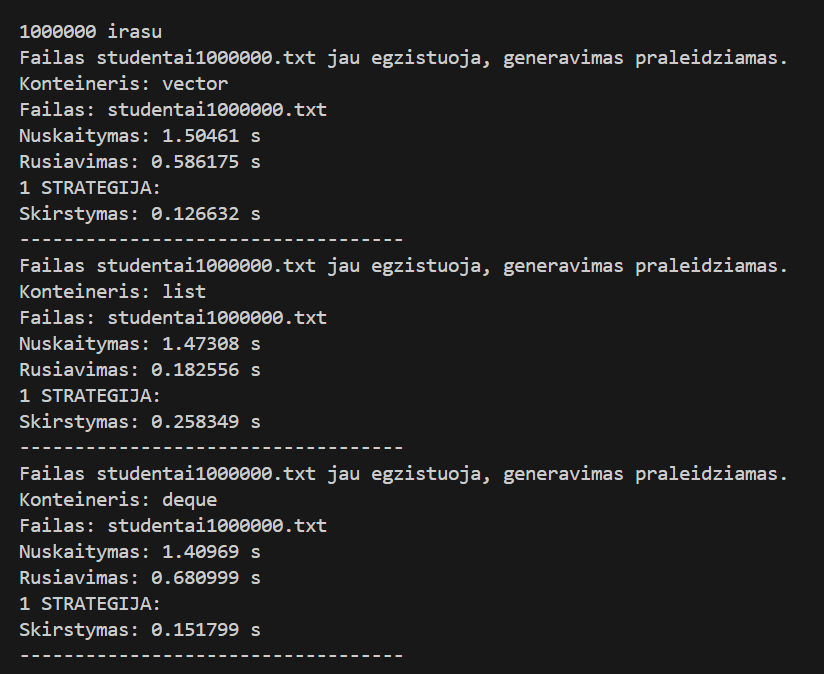
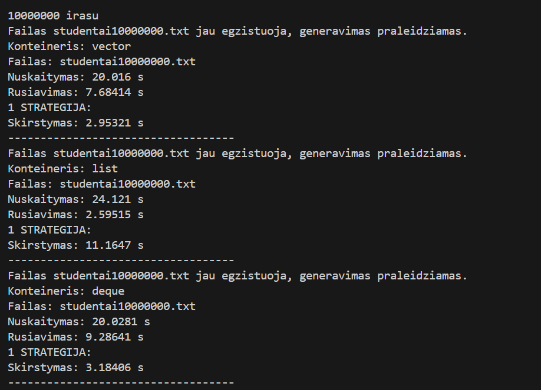

## Studentų rūšiavimo ir failų generavimo programa v1.0

### Projekto aprašymas:
Ši programos versija v1.0 sukurta v0.4 pagrindu.
Programoje realizuotas studentų failų generatorius, studentų duomenų nuskaitymas, galutinio balo skaičiavimas, studentų skirstymas į dvi kategorijas ir rezultatų išvedimas į atskirus failus.

Papildomai atliktas skirtingų konteinerių veikimo spartos tyrimas.

#### Studentai skirstomi į dvi grupes:
- vargšiukai – kai galutinis balas < 5.0
- kietiakai – kai galutinis balas >= 5.0

#### v1.0 versijoje atlikti koregavimai:
- Sukurta nauja šaka v1.0 pagal v0.4
- Išlaikytas failų generatorius ir testavimo failai
- Įgyvendintas konteinerių veikimo spartos tyrimas naudojant:
  - std::vector
  - std::list
  - std::deque
- Programoje pritaikyta galimybė testuoti skirtingus konteinerius
- Atlikta išsami spartos analizė su skirtingais konteineriais

#### Tyrimas:

Kompiuterio parametrai:

Buvo matuojama:
- duomenų nuskaitymas iš failo į atitinkamą konteinerį
- rūšiavimas didėjančia tvarka konteineryje
- studentų skirstymas į dvi grupes

#### Testavimo rezultatai:

