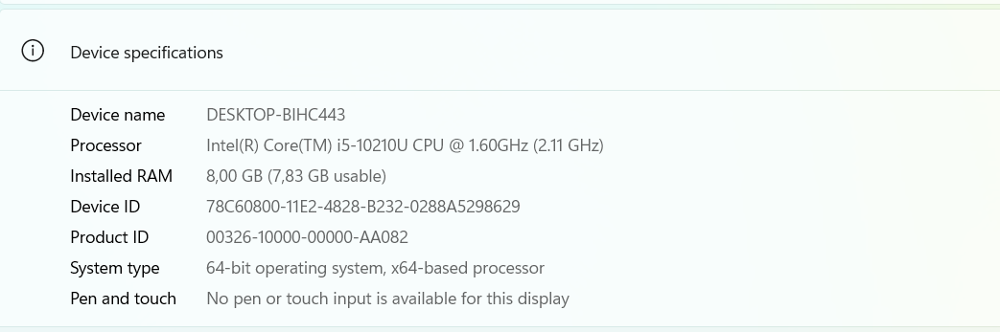

## Studentų rūšiavimo ir failų generavimo programa v0.4

### Projekto aprašymas:

Ši programos versija v0.4 sukurta v0.3 pagrindu.  
Programoje realizuotas studentų failų generatorius, studentų duomenų nuskaitymas, galutinio balo skaičiavimas, studentų skirstymas į dvi kategorijas ir rezultatų išvedimas į atskirus failus.

#### Studentai skirstomi į dvi grupes:
- vargšiukai – kai galutinis balas `< 5.0`
- kietiakai – kai galutinis balas `>= 5.0`

#### v0.4 versijoje atlikti koregavimai:
- Sukurta nauja šaka v0.4 pagal v0.3
- Pridėta failų generatoriaus funkcija
- Sugeneruoti 5 skirtingų dydžių studentų failai:
  - 1000 įrašų
  - 10000 įrašų
  - 100000 įrašų
  - 1000000 įrašų
  - 10000000 įrašų
- Įgyvendintas studentų skirstymas į dvi grupes
- Sugeneruoti rezultatai išvedami į du atskirus failus
- Atlikta programos spartos analizė, testavimas

#### Tyrimai:
Kompiuterio parametrai:

Buvo atlikti 2 pagrindiniai tyrimai.

1 tyrimas – failų kūrimo sparta
Šio tyrimo metu matuotas:
- failo sukūrimo laikas
- duomenų įrašymo laikas
- failo uždarymo laikas

2 tyrimas – duomenų apdorojimo sparta 
Buvo matuojama:
- duomenų nuskaitymas iš failo
- studentų skirstymas į dvi grupes
- rezultatų išvedimas į du naujus failus
- bendras programos veikimo laikas

#### Testavimo rezultatai:

