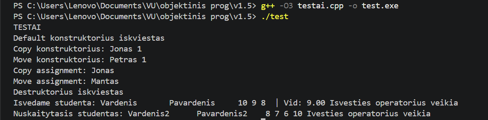

# V1.5

## Programos atnaujinimas

v1.5 versija yra išplėsta v1.2 versija, kurioje pagrindinis dėmesys skirtas:
- Base ir derived klasių kūrimui
- Base klasės padarymas abstrakčia
- Testų kartojimas

## „Rule of Five“ realizacija

Klasėje `Studentas` realizuoti visi būtini metodai:

- Konstruktorius
- Kopijavimo konstruktorius (copy)
- Perkėlimo konstruktorius (move)
- Kopijavimo priskyrimo operatorius (copy assigment operator)
- Perkėlimo priskyrimo operatorius (move assigment operator)
- Destruktorius

## Įvesties / išvesties operatoriai

Klasėje `Studentas` perdengti operatoriai:
- `operator>>` – duomenų įvedimui
- `operator<<` – duomenų išvedimui

### Įvesties būdai:
- rankiniu būdu (per `cin`)
- nuskaitymas iš failo
- automatinis generavimas

### Išvesties būdai:
- į ekraną (`cout`)
- į failą

## Testavimas

Sukurtas atskiras testavimo failas (`testai.cpp`), kuriame tikrinami visi klasės metodai.

### Testuojami elementai:

- visi konstruktoriai
- kopijavimo operacijos
- perkėlimo (move) operacijos
- destruktorius
- įvesties/išvesties operatoriai

### Testavimo principas:

- sukuriami objektai skirtingais būdais
- tikrinama ar duomenys korektiškai kopijuojami
- tikrinama ar move operacijos perkelia duomenis
- tikrinamas išvedimo formatas

### Versija v1.5 su abstrakčia ir išvestine klase veikia taip pat pilnai, abstrakčios (base) klasės objektų kūrimas yra negalimas

## Programos funkcionalumas

Programa:
- nuskaito studentų duomenis iš failo
- leidžia įvesti duomenis rankiniu būdu
- gali generuoti atsitiktinius studentus
- apskaičiuoja galutinį balą (vidurkis / mediana)
- rūšiuoja studentus
- skirsto į grupes pagal rezultatus
- leidžia naudoti skirtingus konteinerius:
  - `vector`
  - `list`
  - `deque`
- matuoja veikimo laikus

## Išvados

- „Rule of Five“ realizacija leidžia efektyviai valdyti atmintį
- move operacijos sumažina nereikalingą kopijavimą
- perdengti operatoriai supaprastina darbą su duomenimis
- klasė tampa universalesnė ir tinkama tolimesniam naudojimui
